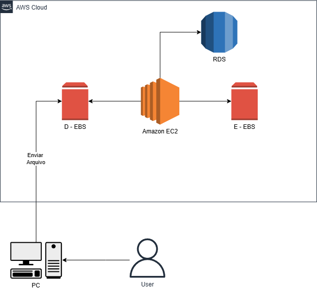

# Gerenciando Instâncias EC2 na AWS

## Introdução

Nesta etapa do bootcamp, criei uma arquitetura simples usando Amazon EC2, Amazon S3 e AWS Lambda para simular um sistema de upload e processamento de músicas. \
O objetivo foi aplicar os conceitos aprendidos sobre instâncias EC2, armazenamento e funções serverless, consolidando o aprendizado de forma prática.

## Descrição do Desafio

Este laboratório tem como objetivo consolidar os conhecimentos em gerenciamento de instâncias EC2 na AWS.\
O entregável consiste em um repositório organizado contendo anotações, diagramas e insights obtidos durante a prática.

## Arquitetura Criada

A arquitetura desenvolvida segue o diagrama abaixo:

## Explicação da Arquitetura

A arquitetura ilustrada representa um fluxo simples de envio, armazenamento e processamento de arquivos utilizando serviços essenciais da AWS. \
O objetivo é demonstrar como uma instância EC2 pode interagir com volumes EBS e com um banco de dados RDS para realizar operações de maneira estruturada e persistente.

### 1. Envio do Arquivo pelo Usuário

O processo inicia no usuário, que utiliza seu computador para enviar um arquivo para a aplicação hospedada na AWS. Esse envio chega diretamente à instância EC2, responsável por receber, validar e manipular os dados inicialmente.

### 2. Processamento pela Instância EC2

A Amazon EC2 funciona como o servidor principal do sistema. Ela executa a aplicação que controla o fluxo entre: 
- Armazenamento temporário e
persistente em EBS
- Comunicação com o banco de dados RDS
- Interação com o usuário

### 3. Volumes EBS (Elastic Block Store)

A arquitetura utiliza dois volumes EBS conectados à instância EC2:

-   **D - EBS (Disco D):** Destinado a receber ou armazenar arquivos enviados pelo usuário.

-   **E - EBS (Disco E):** Utilizado para processamento adicional, armazenamento definitivo ou separação lógica de dados.

### 4. Integração com Banco de Dados RDS

A instância EC2 se comunica com o Amazon RDS, onde ficam informações estruturadas como: 
- Metadados dos arquivos enviados
- Dados de usuários
- Histórico de envios e processamento
- Registros de operações

### 5. Retorno ao Usuário

Após o upload e operações internas, a aplicação pode enviar respostas ao usuário, como confirmação do envio, status do processamento ou disponibilidade do arquivo resultante.

## Conceitos Importantes

### Amazon EC2

O Amazon EC2 (Elastic Compute Cloud) permite criar servidores virtuais sob demanda, escaláveis e configuráveis de acordo com a necessidade do
projeto.

### Snapshots EBS

EBS Snapshots são backups incrementais dos volumes EBS. Permitem recuperar estados anteriores e garantir resiliência.

### Amazon AMI

AMI (Amazon Machine Image) é uma imagem que contém o sistema operacional, pacotes e configurações necessárias para iniciar uma instância EC2.
